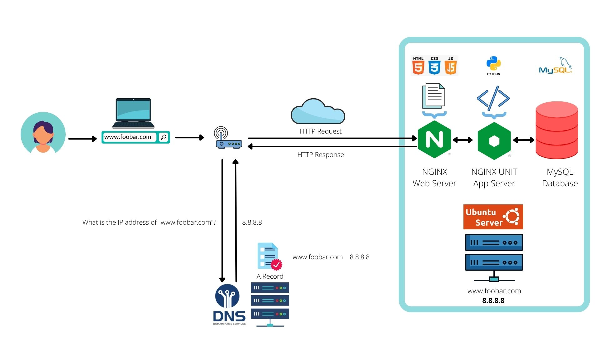
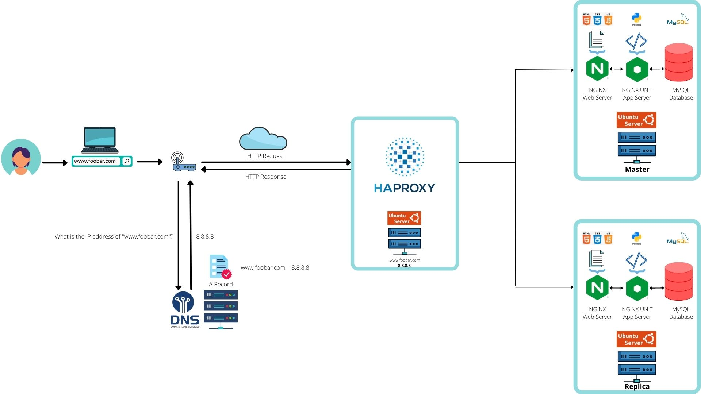
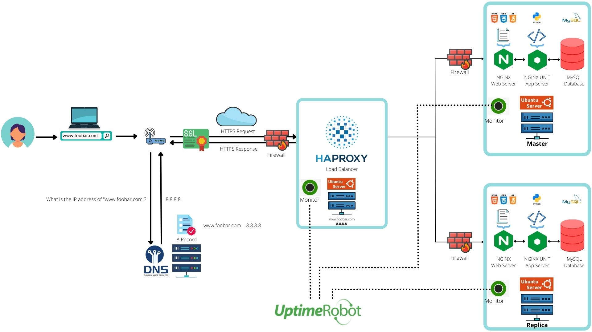

# 0x09. Web infrastructure design 

---

### 0-simple_web_stack 
* 1 server
* 1 web server (Nginx)
* 1 application server
* 1 application files (your code base)
* 1 database (MySQL)
* 1 domain name foobar.com configured with a www record that points to your server IP 8.8.8.8

---

### 1-distributed_web_infrastructure 
* 2 servers
* 1 web server (Nginx)
* 1 application server
* 1 load-balancer (HAproxy)
* 1 set of application files (your code base)
* 1 database (MySQL)

---

### 2-secured_and_monitored_web_infrastructure 
* 2 servers
* 1 web server (Nginx)
* 1 application server
* 1 load-balancer (HAproxy)
* 1 set of application files (your code base)
* 1 database (MySQL)
* 3 Firewalls
* 1 SSL certificate to serve www.foobar.com over HTTPS
* 3 monitoring clients

---